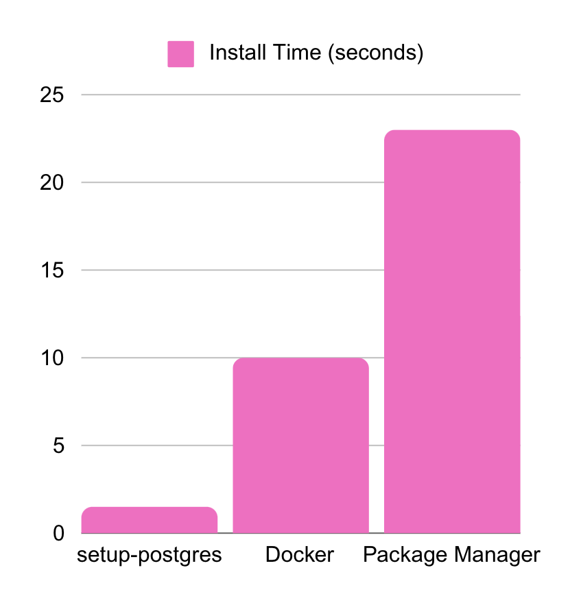

# setup-postgres

Lightning-fast Postgres setup for GitHub Actions that just works. Cross-platform, unconfined, and ready for all environments GitHub Actions supports.



# Features

- **Pure Speed**: Binary-based installation that gets you running in seconds
- **Zero Friction**: No Docker, no package managers - just what you need
- **Universal**: Works across every OS and architecture GitHub Actions supports
- **No yaml hassle**: Environment variables pre-configured for immediate use in following steps, without intermediate yaml

# Get Started

```yaml
steps:
  - uses: bmizerany/setup-postgres@v3
  
  # Your steps here
  - run: psql 'SELECT 1'
  - run: go test ./...
  - run: bun test
```

That's all it takes. No configuration needed.

# Core Features

## Version Support

The default version is `17.2.0`.

Install any Postgres version using standard semantic versioning (`X.Y.Z`). We pull directly from the embedded-postgres project's verified binaries.

Browse available versions [here](https://repo1.maven.org/maven2/io/zonky/test/postgres/embedded-postgres-binaries-linux-amd64/).

Versions can be specified using the version input:

```yaml
steps:
  - uses: bmizerany/setup-postgres@v3
    with:
        version: 16.4.0
```

## Environment Configuration
Your workflow steps automatically get these environment variables:

| Variable | Purpose | Default |
| --- | --- | --- |
| `PGHOST` | Connection host | `localhost` |
| `PGPORT` | Connection port | `5432` |
| `PGUSER` | Username | `postgres` |
| `PGPASSWORD` | Password | `postgres` |
| `PGDATABASE` | Target database | `postgres` |
| `PGDATA` | Data directory | *runtime path* |
| `DATABASE_URL` | Connection string | DSN format |

The `DATABASE_URL` uses DSN format for maximum flexibility. For URL format, construct it like this:
```
postgres://$PGUSER:$PGPASSWORD@$PGHOST:$PGPORT/$PGDATABASE
```

## Configuration Options

### Inputs
| Name | Purpose | Default |
| --- | --- | --- |
| `version` | Postgres version | `17.2.0` |

### Outputs
For advanced workflow configuration:

| Name | Purpose |
| --- | --- |
| `dsn` | Database connection string |
| `data` | Postgres data directory |

# Performance Notes

This action runs Postgres in fast mode, disabling `fsync` and `full_page_writes`. Perfect for CI/CD, not recommended for production. Your tests will fly.

# Acknowledgments

Built on the shoulders of giants:
- [embedded postgres project](https://github.com/zonkyio/embedded-postgres) for their essential binary distributions
- The Postgres community for their foundational work

# Contributing

We value collaboration:
- Open issues for features and bugs
- Discuss major changes before PR
- Small fixes welcome anytime
- Be kind, or else

---

*Note: This project thrives because of community support. Consider supporting the embedded postgres project if you find value here.*​​​​​​​​​​​​​​​​
